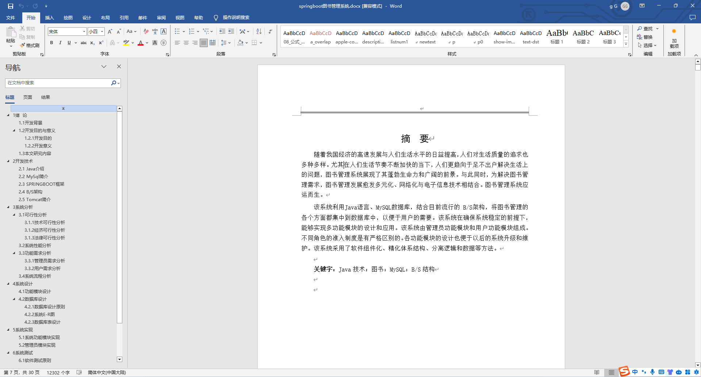
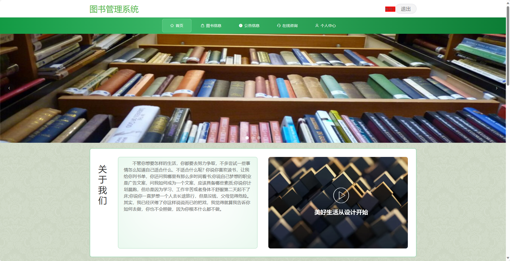
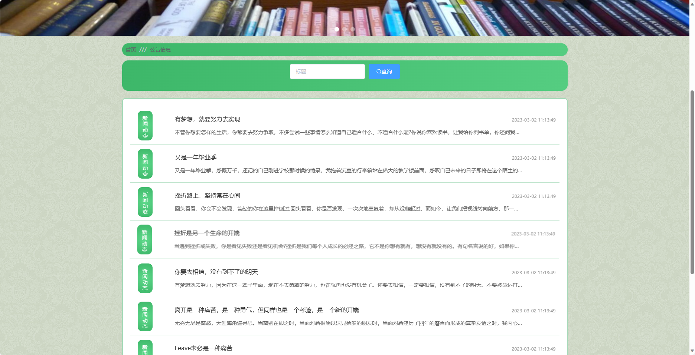
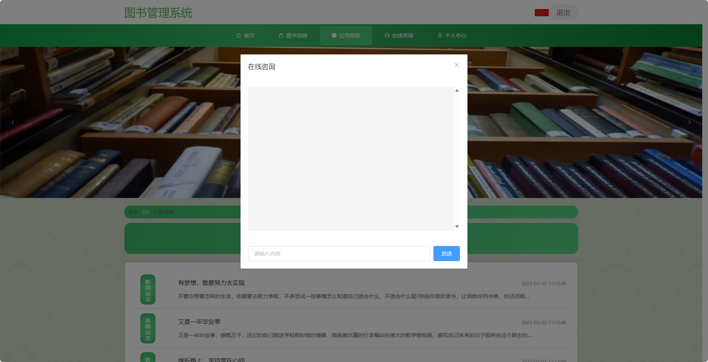
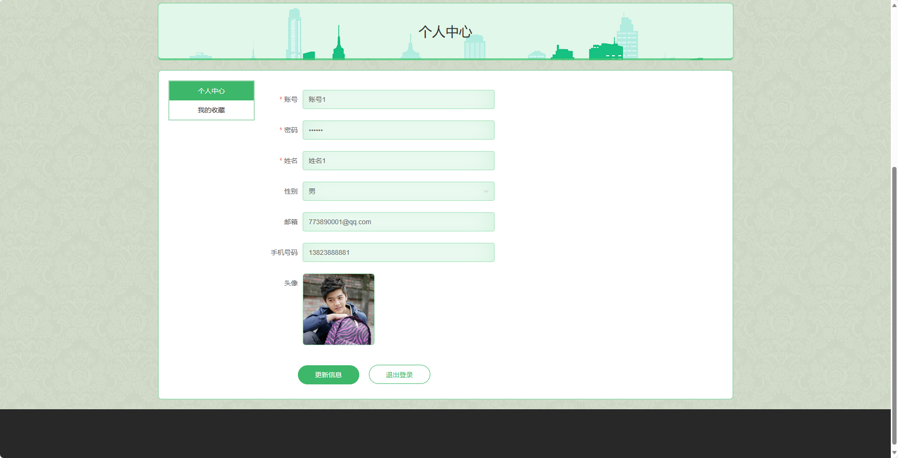
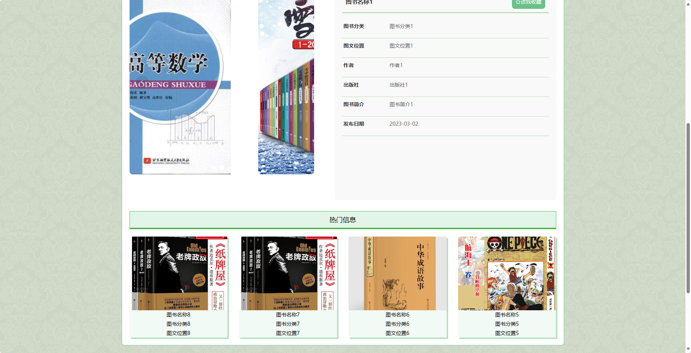
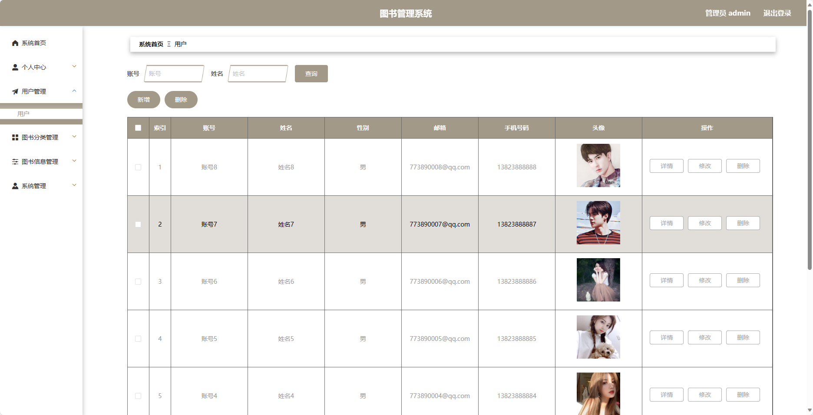
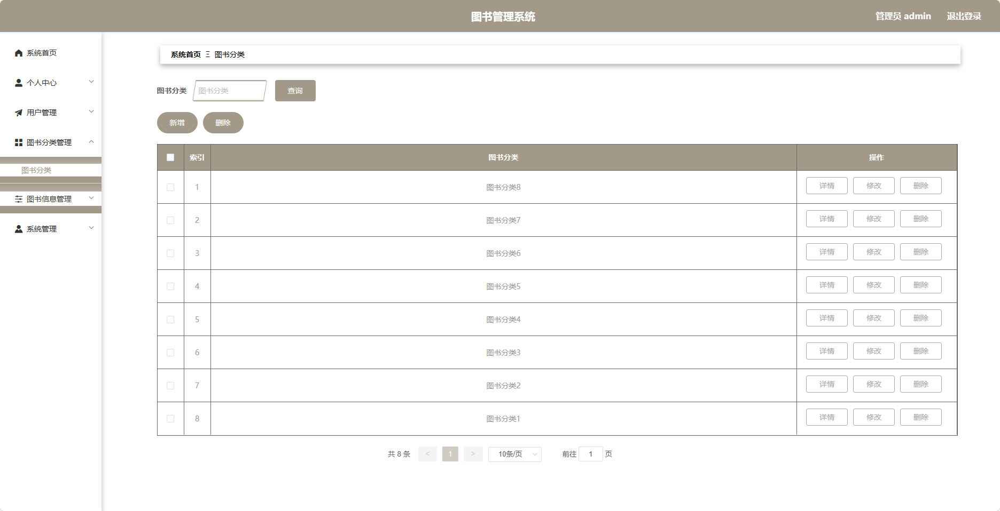
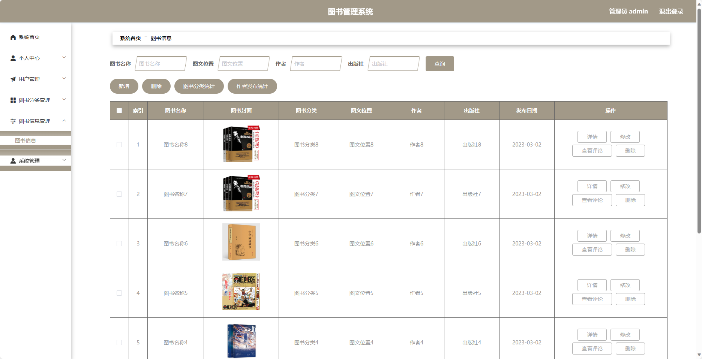
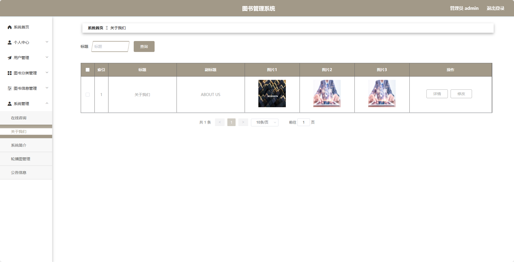

## 基于SpringBoot的图书管理系统(程序+报告)

- <b>完整代码获取地址：从戎源码网 ([https://armycodes.com/](https://armycodes.com/))</b>
- <b>技术探讨、资料分享，请加QQ群：692619798</b> 
- <b>作者微信：19941326836  QQ：952045282</b> 
- <b>承接计算机毕业设计、Java毕业设计、Python毕业设计、深度学习、机器学习</b>
- <b>选题+开题报告+任务书+程序定制+安装调试+论文+答辩ppt 一条龙服务</b>
- <b>所有选题地址 ([https://github.com/YuLin-Coder/AllProjectCatalog](https://github.com/YuLin-Coder/AllProjectCatalog)) </b>

## 项目介绍
基于SpringBoot的图书管理系统，系统包含两种角色：管理员、用户,系统分为前台和后台两大模块，主要功能如下。

### 【管理员】:
- 个人中心：管理员可以管理个人信息，修改密码等。
- 用户管理：管理员可以对用户的信息进行增删改查等操作。
- 图书分类管理：管理员可以管理图书分类信息，添加、修改、删除分类名称及其描述。
- 图书信息管理：管理员可以管理图书的基本信息。
- 系统管理：管理员可以管理系统的一些通用配置。

### 【前台】:
- 首页：展示系统的概览信息。
- 图书信息：展示图书的详细信息。
- 公告信息：展示图书馆相关的通知公告。
- 在线咨询：提供在线客服咨询服务。
- 个人中心：用户可以登录后进入个人中心

## 项目技术
- 编程语言：Java
- 数据库：MySQL
- 项目管理工具：Maven
- 前端技术：HTML、CSS、JavaScript、Jquery、Vue
- 后端技术：Spring、SpringMVC、MyBatis

## 运行环境
- JDK版本：JDK1.8及以上
- 开发工具：IDEA、Ecplise、Myecplise都可以
- 数据库: MySQL5.7及以上
- Maven：maven3.0及以上
- Node：14.14.0及以上

## 运行截图

